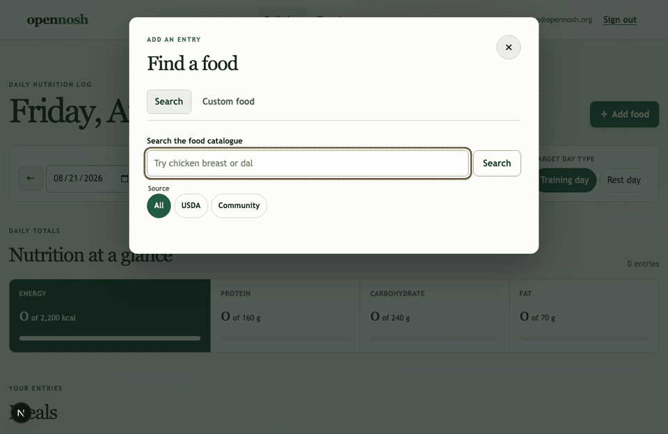

# opennosh

Self-hosted nutrition and strength tracking built around food data the community can improve.

Website: [opennosh.org](https://opennosh.org) (currently redirects to this repository).



_Search the food catalogue, log a serving, and see the daily totals update. The animation plays once;
[view the final daily-total screen](docs/assets/opennosh-daily-total.png)._

> **Build status:** The scoped v1 implementation and both human review gates are complete. The [v1 implementation epic](https://github.com/RujitRaval/opennosh/issues/3) records the shipped work and public-launch evidence.

The application is MIT-licensed. Community food packs are dedicated under CC0 1.0 with visible contributor credit. The repository is public, security researchers can use GitHub's private vulnerability-reporting flow, and general messages can be sent to `support@opennosh.org` through free inbound forwarding.

See [`NOTICE.md`](NOTICE.md) for the combined distribution notice and [`LICENSES.md`](LICENSES.md)
for the repository-wide licensing map. The running web app exposes the same source-separated summary
at `/notices`, linked from the global footer.

The canonical public packages are live: install the Python application and CLI with
`pip install opennosh==0.22.0.0`, or start a safe local checkout with
`npx opennosh@0.22.0 init my-opennosh`. The [PyPI](https://pypi.org/project/opennosh/0.22.0.0/)
and [npm](https://www.npmjs.com/package/opennosh) releases are controlled by active GitHub Actions
trusted publishers using short-lived OIDC credentials. Exact release hashes, controls, and
verification evidence are recorded in [`docs/package-operations.md`](docs/package-operations.md).

## Quick start

Docker Compose starts PostgreSQL, validates the global database-capacity contract, runs one migration
job, then starts the FastAPI web role, the Next.js app, and its nginx ingress:

```bash
cp .env.example .env
docker compose up --build
```

Open the web app at <http://localhost:3000>. The API health endpoint is <http://localhost:8000/healthz>; it returns `200` when PostgreSQL is reachable and a safe `503` degraded response when the database is unavailable.

For native development, install Python 3.11+, uv, Node.js 24 LTS (24.15+; Node 25 is unsupported), npm, and Docker, then run:

```bash
make install
make lint typecheck test build compose-config
make foodpack-validate
```

Compose runs capacity preflight and Alembic as one-shot jobs; the web container never migrates on
startup. The [database-capacity runbook](docs/operations/database-capacity.md) documents role pools,
reserved recovery headroom, scaling checks, overload behavior, and internal metrics. For native
development, set `DATABASE_URL` and manage the schema directly:

```bash
make db-upgrade
make db-downgrade
```

`db-downgrade` returns a development database to the empty base revision. Do not run it against data you need to keep.

After upgrading the database, validate and load one pack or every pack below a repository root:

```bash
uv run opennosh foods load ./packs --json
```

The loader commits valid entries, reports and skips invalid entries, treats an unchanged pack as a
no-op, and refuses to overwrite a newer pack version.

### Starter food packs

opennosh ships four CC0 starter packs with 165 entries:

- 50 Gujarati home-cooking foods;
- 60 North Indian staples;
- 30 common vegetarian proteins; and
- 25 generic supplements and powders.

All 144 government-database entries link to an exact USDA FoodData Central record. The 21
calculated entries disclose component weights, FDC IDs, and cooked yield. Every entry has visible
credit and a named portion. See [the source, spot-check, checksum, and zero-warning validation
evidence](docs/starter-pack-quality.md).

### Food search API

Search USDA reference foods and CC0 community foods without combining their source records:

```text
GET /api/v1/foods/capabilities
GET /api/v1/foods/search?q=apple&locale=en-IN&source=community&limit=20
GET /api/v1/foods/search?q=apple&locale=en-IN&source=community&limit=20&cursor=<next_cursor>
GET /api/v1/foods/community/apple
GET /api/v1/foods/usda/171688
```

`/foods/capabilities` reports whether barcode lookup is enabled so clients can hide that workflow
without probing the third-party integration. It is public and does not make an Open Food Facts
request.

Every result uses a source-qualified ID such as `community:apple` or `usda:171688` and returns
the source and license metadata needed for attribution. Results rank exact community slugs first,
then community foods matching the requested locale, USDA generic foods, and community foods from
other locales. The optional `source` filter accepts `community` or `usda`.

Raw queries must contain 2–100 characters; after whitespace normalization they must still contain
at least two characters and a letter or number. A request returns at most 50 rows. When another
page exists, the response includes an opaque `next_cursor`; send it back with the same query,
locale, source filter, and limit. Results remain bound to the retained projection snapshot even if
the live catalogue changes. Invalid cursors return a typed `400 search_cursor_invalid` problem;
expired snapshots, changed search inputs, or retired signing keys return a typed
`409 search_cursor_restart` problem with a safe first-page recovery link.

Public search defaults to 120 requests per source IP per 60 seconds and a 500 ms PostgreSQL
statement timeout. Projection rebuilds have a separate 30-second ceiling; concurrent requests use
a retained snapshot or receive retry guidance instead of waiting on the builder. Snapshots refresh
after 300 seconds, remain available for 1,200 seconds, and issue cursors valid for up to 900
seconds. Configure these guards with
`FOOD_SEARCH_RATE_LIMIT_ATTEMPTS`, `FOOD_SEARCH_RATE_LIMIT_WINDOW_SECONDS`,
`FOOD_SEARCH_STATEMENT_TIMEOUT_MS`, `FOOD_SEARCH_CURSOR_LIFETIME_SECONDS`,
`FOOD_SEARCH_SNAPSHOT_REFRESH_SECONDS`, `FOOD_SEARCH_SNAPSHOT_RETENTION_SECONDS`, and
`FOOD_SEARCH_SNAPSHOT_BUILD_TIMEOUT_MS`.

Production must set `FOOD_SEARCH_CURSOR_SIGNING_KEYS` to a unique current key, optionally followed
by the previous key during rotation, using `current-id:at-least-32-byte-secret,previous-id:secret`.
The first key signs new cursors; both keys verify existing cursors. Never reuse the documented
development value. The production container disables Uvicorn access logging so normalized search
terms and cursor query parameters are not copied into request logs.

PostgreSQL full-text and trigram indexes back the retained projection. The integration performance
gate loads 10,000 representative rows, verifies snapshot-indexed execution, and budgets less than
100 ms of PostgreSQL execution time. The release-scale decision is governed by the
[versioned representative benchmark](benchmarks/performance/README.md), which pins the
launch-reference, 10x, and 100x corpora, mixed workload, cache states, latency/relevance gates, and
machine-readable evidence needed before considering a dedicated search projection.

### Open Food Facts barcode lookup

Open Food Facts access is off by default, so local food search, logging, and startup never require
network access. Enable it deliberately and identify your deployment:

```dotenv
OPEN_FOOD_FACTS_ENABLED=true
OPEN_FOOD_FACTS_USER_AGENT_CONTACT=https://example.org/contact
```

Then look up a valid GTIN-8, GTIN-12, GTIN-13, or GTIN-14 barcode:

```text
GET /api/v1/foods/barcode/3017620422003
GET /api/v1/export/foods/odbl
```

The first uncached lookup uses the current Open Food Facts product API with a three-second timeout,
an identifying `opennosh/<version> (<contact>)` User-Agent, and an explicit field allowlist. Product
images are not requested or cached. Later lookups use the isolated `foods_odbl` cache. That cache is
never written to `foods_community` and is exported only through its attributed ODbL/DbCL endpoint;
it is not part of the CC0 food-pack export.

Public lookup traffic defaults to 10 requests per source IP per minute, below Open Food Facts'
published product-read limit. Configure the integration with `OPEN_FOOD_FACTS_BASE_URL`,
`OPEN_FOOD_FACTS_TIMEOUT_SECONDS`, `OPEN_FOOD_FACTS_LOOKUP_RATE_LIMIT_ATTEMPTS`, and
`OPEN_FOOD_FACTS_LOOKUP_RATE_LIMIT_WINDOW_SECONDS`. A second database-backed global limit applies
only to cache misses so callers sharing the deployment's outbound IP cannot collectively exceed the
upstream budget; configure it with `OPEN_FOOD_FACTS_UPSTREAM_RATE_LIMIT_ATTEMPTS` and
`OPEN_FOOD_FACTS_UPSTREAM_RATE_LIMIT_WINDOW_SECONDS`. The separate export has its own rate limit,
PostgreSQL statement timeout, and exact 10,000-row/64 MiB serialized-response ceilings. The legacy
`/api/v1/export/foods/openfoodfacts` path returns the same versioned stream. Invalid GTINs return 422,
missing products return 404, upstream rate limits return 503, upstream timeouts return 504, and
other unusable upstream responses return 502.

## Authentication

The API provides local account registration, login, session inspection, and logout under `/api/v1/auth`. Passwords are hashed with Argon2id and opaque sessions are stored in PostgreSQL; no third-party identity provider is required.

Set `APP_ENVIRONMENT=production` in production. This enables Secure, host-only session and CSRF cookies. Browser clients must copy the `opennosh_csrf` cookie (or `__Host-opennosh-csrf` in production) into the `X-CSRF-Token` header for authenticated state-changing requests. API handlers must use the session-derived helpers in `opennosh_api.auth.tenant`; request bodies and query parameters must never select a `user_id`.

## Daily nutrition log

The tracker at `http://localhost:3000/tracker` provides the responsive primary journey: create an
account or sign in, choose a date and training/rest target, search the ranked local catalogue,
filter USDA or community results, and log a food by grams or a named household portion under any
meal name.
When Open Food Facts is enabled, the same dialog adds barcode lookup; it always offers owner-private
custom-food entry with calories, macros, and optional household portions. Source and contributor
credit stays visible during selection. Loading, empty, API-error, and expired-session screens all
provide a way forward. Keyboard focus is visible, the dialog traps focus, supports arrow-key tab
navigation, closes with Escape, and is checked against WCAG 2.2 AA rules in Playwright on desktop
and mobile. The public root redirects to the localized commons at `/en`; the private tracker keeps
its independent layout and permanent `/tracker` address.

## Nutrition, body-metric, and strength trends

Authenticated users can open `/tracker/trends` to review 7-, 30-, or 90-day history for nutrition,
body measurements, and strength volume. Nutrition days follow the browser's IANA timezone;
body-metric and workout ranges retain the APIs' documented UTC date boundaries. Every visual chart
has a visible data table and keyboard-accessible native range and measure controls. Empty and
single-record states stay descriptive and neutral, without diagnoses, coaching, streaks, or
inferred health advice.

Body measurements remain separated by metric type and unit. Strength volume remains separated by
exercise and load unit, so kilograms, pounds, and machine units are never combined. Bodyweight,
band, and RPE-only sets do not produce volume.

The trends page uses bounded, owner-scoped aggregate endpoints rather than downloading paginated
workout histories. `GET /api/v1/body-metrics/trends?from=2026-08-01&to=2026-08-30` returns the
latest measurement for each UTC day, metric type, and unit. `GET
/api/v1/workouts/trends?from=2026-08-01&to=2026-08-30` returns daily volume grouped by exercise and
numeric load unit. Both accept inclusive UTC ranges of at most 90 days.

The browser calls only same-origin `/api/v1` paths. The Next.js server forwards those requests to
`API_URL`, which Compose sets to the internal `api` service. For local web development outside
Compose, leave the default API address at `http://localhost:8000` or set `API_URL` explicitly. In
Compose, nginx is the only public web ingress and replaces caller-supplied forwarding headers with
the actual peer address. The Next.js proxy authenticates that address to the API with
`WEB_PROXY_TOKEN`, keeping source-address rate limits isolated instead of collapsing onto the web
container. Generate a unique token of at least 32 characters for production. The web container is
not published, and the Compose API port is bound to loopback, so remote callers cannot forge the
private proxy headers.

Run the browser journey after installing Chromium once:

```bash
npx --prefix web playwright install chromium
npm --prefix web run test:e2e
```

## Nutrient calculations

The `opennosh_api.nutrition` module validates nutrient maps, canonicalises source values to a per-100-gram internal basis, and converts grams, millilitres, and named household portions into immutable nutrient snapshots. Volume conversion requires an explicit food density; opennosh never guesses that one millilitre equals one gram. Calculations use a fixed 50-significant-digit decimal context, presentation rounding happens only through the API-boundary helper, and its JSON payload uses decimal strings so values do not change in transit.

## Food logging

Authenticated users can create, list, read, and delete tenant-isolated food-log entries under
`/api/v1/logs`. Create requests use the `source` and `source_id` returned by food search, plus an
offset-aware timestamp, a configurable meal-slot label, and a quantity in grams, millilitres, or
a named household portion:

Create an owner-private food before logging it with `POST /api/v1/foods/custom`. The mutation
requires the authenticated session's CSRF token and accepts a canonical per-100-gram profile plus
up to 20 optional, uniquely named portions:

```json
{
  "name": "Homemade paneer",
  "nutrients": {
    "basis": "per_100g",
    "nutrients": {
      "energy_kcal": "265",
      "protein_g": "18.3",
      "fat_g": "20.8",
      "carbohydrate_g": "1.2"
    }
  },
  "portions": [{"name": "1 cube", "grams": "30"}]
}
```

The response identifies the food with `source: "custom"` and `private: true`. Custom foods remain
owner-scoped, never appear in public search, and are excluded from public dataset exports.

```json
{
  "logged_at": "2026-08-20T18:30:00-04:00",
  "meal_slot": "post workout",
  "food": {"source": "community", "source_id": "dal-rice"},
  "quantity": {"amount": "1.5", "unit": "portion", "portion_name": "1 bowl"}
}
```

`POST /api/v1/logs` and `DELETE /api/v1/logs/{entry_id}` require the authenticated session's
CSRF token in `X-CSRF-Token`. The server resolves the source food, converts the quantity, and
stores the food identity, original quantity, gram mass, and computed nutrients on the log row.
Later source-food corrections therefore never rewrite historical nutrition. To correct an entry,
delete it and create a replacement; there is deliberately no recalculating update endpoint.

Use `GET /api/v1/logs?day=2026-08-20&timezone=America/New_York` for a stable paginated local-day
view and `GET /api/v1/logs/daily-totals?day=2026-08-20&timezone=America/New_York` for exact daily
mass and nutrient totals. The timezone parameter accepts IANA names and overrides the user's saved
`settings_json.timezone`; when neither exists, the API uses UTC. Day boundaries are converted to
UTC after applying the selected timezone, including 23- and 25-hour daylight-saving days. Every
read and mutation derives `user_id` from the session, returns `404` for another user's entry or
custom food, and sends `Cache-Control: no-store`.

For chart-sized history, use
`GET /api/v1/logs/daily-totals/range?from=2026-08-01&to=2026-08-30&timezone=America/New_York`.
The inclusive range is limited to 90 days, returns one item per local calendar day (including empty
days), and uses the same saved-timezone fallback and daylight-saving semantics as the single-day
endpoint.

## Private recipes

Authenticated recipe CRUD is available under `/api/v1/recipes`. A create or full-replacement
request supplies a name, the finished recipe's yield in grams, and one to 100 source-qualified
ingredients with gram quantities:

```json
{
  "name": "Sunday dal",
  "yield_grams": "1400",
  "ingredients": [
    {"food": {"source": "usda", "source_id": "169090"}, "grams": "200"},
    {"food": {"source": "custom", "source_id": "7d735537-5ddf-4ec4-91ad-1f8153229619"}, "grams": "30"}
  ]
}
```

Ingredient sources may be `usda`, `community`, `openfoodfacts`, or `custom`. List recipes with
`GET /api/v1/recipes?limit=50&offset=0`; `limit` accepts 1–100, `offset` accepts 0–10,000, and the
response includes `has_more`. `POST`, `PUT`, and `DELETE` require the session CSRF token.

`POST` and `PUT` snapshot each ingredient's identity, exact mass, and nutrients. Recipe detail and
totals therefore remain stable if an underlying public food changes or a private custom food is
deleted. The response includes whole-recipe totals and a yield-derived per-100-gram profile. All
recipe reads and writes are owner-scoped, respond with `Cache-Control: no-store`, and keep recipes
out of public food-pack data.

Log a recipe through the ordinary `POST /api/v1/logs` endpoint with
`{"source":"recipe","source_id":"<recipe UUID>"}`. A gram quantity scales the stored profile
directly. A named portion of `"whole recipe"` maps exactly to the stored yield, so an amount of
`"0.25"` logs one quarter of the recipe. The resulting log is itself immutable and remains readable
after the recipe is edited or deleted.

## Calorie and macro targets

Authenticated users manage their own dated target schedule under `/api/v1/targets`. A full
replacement uses the session CSRF token and supplies non-overlapping inclusive date ranges for
`training` and `rest` days:

```json
{
  "items": [
    {
      "day_type": "training",
      "kcal": "2500",
      "protein_g": "180",
      "carb_g": "300",
      "fat_g": "65",
      "active_from": "2026-08-01",
      "active_until": null
    }
  ]
}
```

Use `GET /api/v1/targets` to read the complete schedule and
`GET /api/v1/targets/resolve?day=2026-08-20&day_type=training` to resolve one date
deterministically. Target values are always entered by the user; opennosh never calculates or
prescribes them. The configurable `TARGET_KCAL_FLOOR` defaults to 1200 kcal. A lower user-entered
value is accepted only when that schedule item includes `"confirm_below_floor": true`, and the
confirmation plus the applicable floor are stored with the target. All target responses are
owner-scoped and send `Cache-Control: no-store`.

## Private body metrics

Authenticated users can create, list, and delete their own measurements under
`/api/v1/body-metrics`. Create a record with the session CSRF token:

```json
{
  "recorded_at": "2026-08-20T08:30:00-04:00",
  "metric_type": "body_weight",
  "value": "80.125",
  "unit": "kg"
}
```

Supported pairs are `body_weight` with `kg` or `lb`, `body_fat_percentage` with
`percent`, and `height`, `waist_circumference`, `hip_circumference`,
`chest_circumference`, `neck_circumference`, `upper_arm_circumference`, or
`thigh_circumference` with `cm` or `in`. Values are positive exact decimals with at most
four decimal places.

List an inclusive UTC date range with
`GET /api/v1/body-metrics?from=2026-08-01&to=2026-08-31&limit=100&offset=0`.
Both dates are required, results are newest first, and the response includes `has_more`.
Every query is owner-scoped; deleting another user's ID returns the same `404` as a missing
record. Successful and failed responses send `Cache-Control: no-store`. The stable record
shape (`id`, `recorded_at`, `metric_type`, `value`, and `unit`) is also the representation
used by the authenticated `/export/me` response. opennosh stores and reports
these numbers without streaks, shaming, or automated medical interpretation.

## Private strength workouts

Authenticated users can create and manage their own workouts under `/api/v1/workouts`. A workout
has a timezone-aware `performed_at`, optional notes, and up to 500 ordered sets. Each set refers to
an attributed exercise and records reps plus one of `kg`, `lb`, `bodyweight`, `band`,
`machine_units`, or `rpe_only`. `kg`, `lb`, and `machine_units` require a nonnegative
`load_value`; `bodyweight` and `band` omit it; and `rpe_only` stores a rating from 1 through 10 in
`load_value`. For example:

```json
{
  "performed_at": "2026-08-20T18:00:00-04:00",
  "notes": "Upper body",
  "sets": [
    {
      "exercise_id": "66fef1bf-7bb3-4ccf-bd52-dd661006075b",
      "reps": 8,
      "load_value": "60",
      "load_unit": "kg"
    }
  ]
}
```

Use `GET /api/v1/workouts?from=2026-08-01&to=2026-08-31&limit=50&offset=0` for an inclusive
UTC-date range. `limit` accepts 1–100, `offset` accepts 0–10,000, and the response includes
`has_more`. Read, replace workout metadata, or delete a workout with `GET`, `PUT`, or `DELETE`
at `/api/v1/workouts/{workout_id}`. `POST /api/v1/workouts/{workout_id}/sets`,
`PUT /api/v1/workouts/{workout_id}/sets/{set_id}`, and the corresponding `DELETE` endpoint
append, edit, and remove sets without changing the surviving sets' relative order. Mutations
require the session CSRF token, and all responses send `Cache-Control: no-store`.

Every returned set embeds the exercise's source identifier and URL, license identifier and URL,
author fields, attribution text, and translation-level attribution so clients can display the
required credit without a second lookup.

Volume is computed only for `kg`, `lb`, and `machine_units`, and remains separated by exercise
and unit. `GET /api/v1/workouts/volume?from=2026-08-01&to=2026-08-31&exercise_id=<id>`
refuses to combine incompatible units; add `&load_unit=kg` or another exact unit to select one.
Bodyweight, band, and RPE-only sets remain useful records but are never converted into an invented
numeric volume.

## Attributed wger exercise catalogue

Import a downloaded wger `exerciseinfo` JSON export after upgrading the database:

```shell
make db-upgrade
make wger-import WGER_PATHS="downloads/exerciseinfo.json --json"
```

The command reads local files only; neither runtime imports nor automated tests call the live wger
service. It accepts only records whose short name, full name, and license URL unambiguously identify
`CC-BY-SA-3.0`. Missing, NC, ND, conflicting, or unsupported license metadata is reported and
skipped. Safe source and derivative URLs, author information, cleaned plain-text translations, and
complete per-translation attribution are retained. Re-importing the same export is a no-op, and an
older source timestamp cannot replace a newer record.

Search and retrieve the catalogue through the public API:

```text
GET /api/v1/exercises/search?q=squat&muscle=quads&equipment=barbell&limit=20&offset=0
GET /api/v1/exercises/{exercise_id}
GET /api/v1/export/exercises
```

Search is bounded and rate-limited per source IP, with PostgreSQL full-text and taxonomy indexes.
Every search, detail, and export record carries its source, author, license, derivative, and
translation attribution. The export has an explicit Creative Commons Attribution-ShareAlike 3.0
notice and remains separate from the CC0 community-food export; importing exercises never changes
their license to CC0.

Public search and export have independent per-IP limits and PostgreSQL statement timeouts. The JSON
export streams one validated record at a time and refuses catalogues above 10,000 rows or 64 MiB of
serialized JSON so one anonymous request cannot consume unbounded server memory.

Search defaults to 120 requests per source IP per 60 seconds and a 500 ms statement timeout;
configure those guards with `EXERCISE_SEARCH_RATE_LIMIT_ATTEMPTS`,
`EXERCISE_SEARCH_RATE_LIMIT_WINDOW_SECONDS`, and `EXERCISE_SEARCH_STATEMENT_TIMEOUT_MS`. Export
defaults to 10 requests per source IP per 60 seconds and a 2,000 ms statement timeout; configure it
with `EXERCISE_EXPORT_RATE_LIMIT_ATTEMPTS`, `EXERCISE_EXPORT_RATE_LIMIT_WINDOW_SECONDS`, and
`EXERCISE_EXPORT_STATEMENT_TIMEOUT_MS`.

## Private and license-separated exports

opennosh provides four versioned JSON export boundaries:

```text
GET /api/v1/export/me               authenticated private account data
GET /api/v1/export/foods/community public CC0 community-food pack
GET /api/v1/export/foods/odbl       public ODbL/DbCL Open Food Facts cache
GET /api/v1/export/exercises        public CC BY-SA wger catalogue
```

`/export/me` derives the owner from the session and includes that account's settings, custom foods,
recipes and ingredient snapshots, food logs, targets, body metrics, workouts, and sets. It never
includes password hashes, session tokens, CSRF secrets, or another tenant's records, and every
response—including authentication failures—uses `Cache-Control: no-store`.

The three public exports never contain custom foods, recipes, logs, targets, body metrics, or
workouts. Community rows retain pack version, provenance, source-license metadata, and visible
contributor credit under a CC0 notice. Open Food Facts rows retain the separate ODbL/DbCL notices.
Exercise rows retain wger source, author, license, derivative, and translation attribution.

All four responses are valid JSON objects with `schema_version: "1.0.0"`. The server validates and
spools one PostgreSQL row at a time into a secure bounded-memory temporary file, closes the database
snapshot, and then streams that file to the client. Slow downloads therefore do not retain a
database connection. Public dataset exports retain their row, exact serialized-byte, per-IP rate,
and statement-timeout guards. Two shared public spool slots cap retained public temporary data at
128 MiB, while one independently reserved private slot prevents anonymous traffic from blocking a
personal export. Response deadlines close abandoned downloads and release their slots and files.
The private export is rate-limited per authenticated account and has no row ceiling, so a user can
leave with all of their data. Configure the new guards with
`COMMUNITY_EXPORT_RATE_LIMIT_ATTEMPTS`,
`COMMUNITY_EXPORT_RATE_LIMIT_WINDOW_SECONDS`, `COMMUNITY_EXPORT_STATEMENT_TIMEOUT_MS`,
`PRIVATE_EXPORT_RATE_LIMIT_ATTEMPTS`, `PRIVATE_EXPORT_RATE_LIMIT_WINDOW_SECONDS`, and
`PRIVATE_EXPORT_STATEMENT_TIMEOUT_MS`. Shared capacity and deadlines use
`PUBLIC_EXPORT_CONCURRENCY_LIMIT`, `PRIVATE_EXPORT_CONCURRENCY_LIMIT`,
`EXPORT_CAPACITY_WAIT_SECONDS`, `PUBLIC_EXPORT_RESPONSE_TIMEOUT_SECONDS`, and
`PRIVATE_EXPORT_RESPONSE_TIMEOUT_SECONDS`.

### USDA reference-food import

The offline importer accepts FoodData Central JSON files, official JSON ZIP archives,
official relational CSV ZIP archives, or extracted CSV directories. It imports only
Foundation and SR Legacy foods into `foods_reference`; branded, FNDDS, and experimental
rows are ignored. Each accepted row retains its FDC ID, USDA source, CC0 license, source
publication timestamp, nutrients per 100 grams, and gram-based household portions.

Download the bulk files from the [FoodData Central dataset page](https://fdc.nal.usda.gov/download-datasets/),
run migrations, then pass one or more archives:

```shell
make db-upgrade
make usda-import USDA_PATHS="downloads/foundation.zip downloads/sr-legacy.zip"
```

The importer uses `DATABASE_URL` by default and writes 500 records per batch. Override
either setting by including `--database-url <url>` or `--batch-size <count>` in
`USDA_PATHS` after the input paths.

The job streams large JSON archives, bounds archive expansion and record collections,
upserts on FDC ID, and prints progress after each database batch. A rerun updates the same
rows instead of duplicating them, while an older USDA release cannot overwrite a newer
one. Malformed or incomplete source records are identified by FDC ID on standard error;
valid records are still written, and the command exits nonzero when any rows were
rejected. Error output retains a bounded sample and reports how many additional issues
were omitted.

---

## Product documents

| File | Purpose | Who reads it |
|---|---|---|
| `01-RESEARCH.md` | Competitive landscape, the actual gap, why now | You |
| `02-PRD.md` | Product requirements, MVP scope, explicit non-goals | You + `prd-to-github-issues` |
| `03-TRD.md` | Stack, data model, services, API surface | You + `prd-to-github-issues` |
| `04-DATA-LICENSING.md` | **Read this first.** The ODbL constraint that shapes the architecture | You, before any code |
| `docs/foodpack-spec.md` | The contribution unit. The most important file here | Contributors + implementing agent |
| `docs/api-contracts.md` | Canonical OpenAPI, problem-details, generated TypeScript, compatibility, and regeneration contract | API + frontend contributors |
| `docs/health-safety-copy-review.md` | Screen/state inventory and human approval record for health-sensitive copy | Human reviewer + implementing agent |
| `docs/license-notice-review.md` | Approved source-by-source notice matrix and release-artifact inventory | Project owner + release reviewer |
| `docs/domain-operations.md` | Non-secret domain, redirect, DNSSEC, and inbound-mail operations record | Maintainers |
| `docs/package-operations.md` | PyPI and npm release controls, verified publication evidence, and ongoing release procedure | Maintainers + release reviewers |
| `docs/clean-install-verification.md` | Independent-machine Docker Compose, browser QA, and restart-persistence evidence | Operators + release reviewers |
| `DESIGN.md` | Living Commons brand, interface, accessibility, motion, and production asset contract | Designers + frontend contributors |
| `docs/designs/opennosh-full-movement-platform.md` | Finalized public-platform vision, release trains, trust boundaries, and implementation sequence | Product, design, and engineering contributors |
| `web/assets/fonts/README.md` | Self-hosted public font subsets, licenses, loading policy, and integrity hashes | Frontend contributors + release reviewers |
| `NOTICE.md` and `LICENSES.md` | Combined distribution notice and repository-wide licensing map | Users + distributors |
| `06-CONTRIBUTOR-MODEL.md` | How the community layer actually works | You |
| `07-LAUNCH-PLAN.md` | Naming, positioning, launch sequencing | You |
| `08-PRODUCT-DECISIONS.md` | Settled product, licensing, scope, and operating decisions | You + implementing agent |
| `AGENTS.md` and `CLAUDE.md` | Repository workflow, test commands, and GStack routing | Implementing agents |
| `web/AGENTS.md` | Version-specific Next.js guidance generated by the framework | Frontend contributors + implementing agents |
| `CONTRIBUTING.md` | Contribution workflow, boundaries, and validation commands | Contributors |
| `CONVENTIONS.md` | Health-safety, product, and data constraints | Contributors + implementing agent |
| `SECURITY.md` | Private vulnerability-reporting process | Security reporters + maintainers |
| `AUTHORS.md` | Maintainer and contributor credit | Contributors + users |
| `CHANGELOG.md` | Versioned record of shipped changes | Users + maintainers |
| `TODOS.md` | Open follow-up work plus completed launch-readiness and operational records | Maintainers |

---

## How to use this

**Do not hand the whole folder to an agent and say "build it."** That produces a 4,000-line PR nobody can review.

The intended path:

1. Read `04-DATA-LICENSING.md` and `08-PRODUCT-DECISIONS.md` before implementation.
2. Treat `02-PRD.md` and `03-TRD.md` as the settled product and technical inputs.
3. Run the issue-generation pipeline against `02-PRD.md` and `03-TRD.md` to produce a dependency-ordered issue queue.
4. Keep `docs/foodpack-spec.md` in the implementation repository; contributors and the validator both depend on it.
5. Treat `01`, `06`, and `07` as historical strategy and launch context, not implementation inputs.

---

## The one-line pitch

> Every calorie tracker locks your data behind a subscription and can't find your dal. This one runs on your hardware, and the food database is a git repo you can send a PR to.

---

## The thing that will kill this project

Not the code. The food database.

Every prior attempt in this category either (a) leaned entirely on a crowd-sourced database with poor non-Western coverage, or (b) built a food table nobody else could contribute to. If food packs aren't trivially easy to write and merge, this becomes another solo-maintained tracker in a category that already has a dozen. `docs/foodpack-spec.md` is the load-bearing document.
